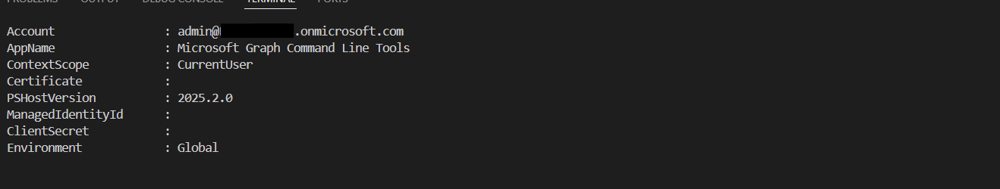
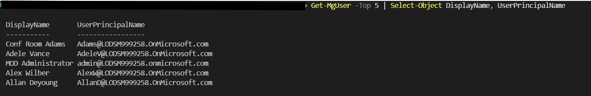
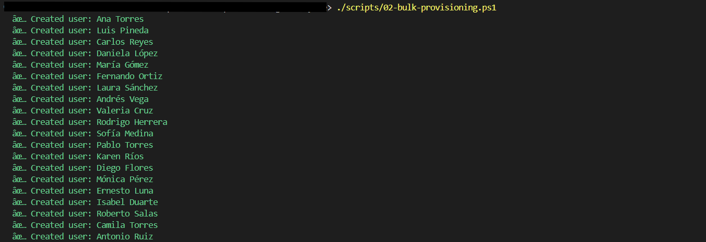
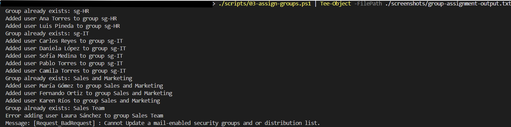
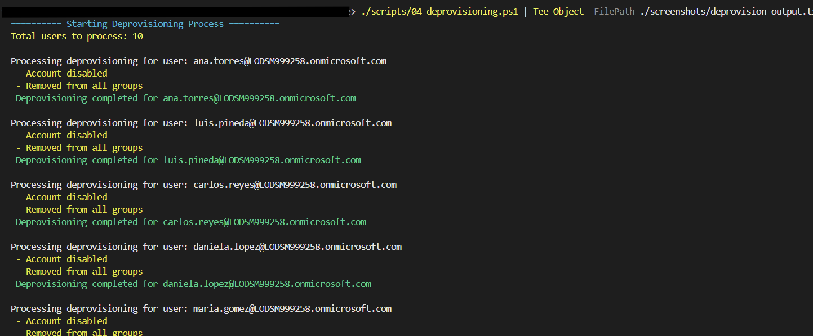
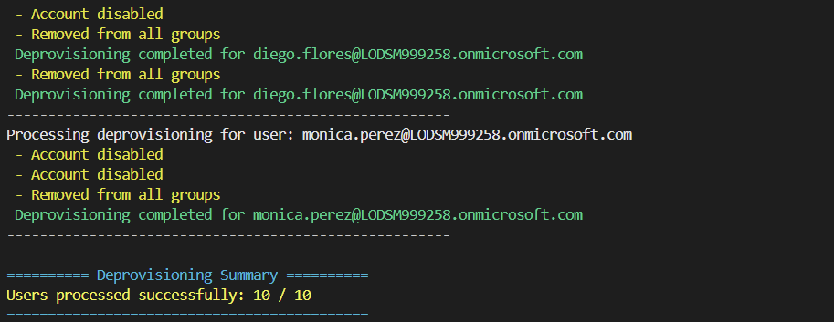

# Microsoft Entra ID — Automated Identity Lifecycle Management

This repository demonstrates an enterprise grade **Identity Lifecycle Management** solution focused on bulk automated user provisioning and deprovisioning using **Microsoft Entra ID (Azure AD)**.

It shows how IAM engineers can automate processes for adding, updating, and deleting users at scale by leveraging Azure automation, PowerShell and Microsoft Graph scripts, simulating realistic enterprise IAM workflows where multiple users are created, updated, and deleting in batches.

---

## 📄 Project Overview

This lab is designed to demonstrate:

- ✅ **Provisioning**: Automatically create a new user in Azure AD and assign them to the correct security groups.
- 🔁 **Role Updates**: Simulate “mover” scenarios by changing department or group membership.
- ❌ **Deprovisioning**: Disable a user and remove their access from all associated groups and resources.

---

## 🧩 Tech Stack

| Component | Description |
|------------|-------------|
| **Azure AD / Entra ID** | Identity directory for user lifecycle operations |
| **PowerShell** | Main automation language |
| **Microsoft Graph API** | Backend interface for directory operations |
| **Azure Automation Account (optional)** | To run scripts on a schedule or event trigger |

---

## 🧠 Lab Scenarios

### 1. **User Provisioning**
I start with the first script, which connects to our administrative account and tennant in Entra ID, allowing us to manage identities using an Azure AD P2 license. 

```powershell
>01-connect-entra.ps1
```


Now I will verify that we are logged into our account by using a Microsoft Graph script, which will list the first five users.

```powershell
>Get-MgUser -Top 5 | Select-Object DisplayName, UserPrincipalName
```

### Powershell Terminal Screenshoot: 
-------

-------

### 2. **Group Assignment**

This step assigns existing users to their appropriate groups based on department data from a CSV file (`groups.txt`).
Each user receives basic properties such as name, email, department, job title, and a default password. This step ensures that all accounts exist in the directory and are ready to be used. Importantly, creating the user does not automatically assign all the groups they need.

**Run the script:**
```powershell
.\scripts\02-bulk-provisioning.ps1 
```
⚠️ Note: The password value shown in the sample script is for demonstration only.
Replace it with a secure variable, prompt, or environment variable when using this script.

**Example CSV:**
```csv
Department,GroupName
Human Resources,HR-Team
IT,IT-Team
Sales,Sales-Team
Finance,Finance-Team
Operations,Operations-Team
Legal,Legal-Team
```
### Powershell Terminal Screenshoot: 

-------



-------
### 3. **Assigning groups**

In this step I use PowerShell script that assigns users to Microsoft Entra ID groups based on their department. It creates groups if they don’t exist, skips mail-enabled groups, and automatically adds the corresponding users, providing clear success and error messages.

**Run the script:**
```powershell
.\scripts\03-assign-groups.ps1 
```

**Expected output:**
```
Group already exists: sg-HR
Added user Ana Torres to group sg-HR
Added user Luis Pineda to group sg-HR
Group already exists: sg-IT
Added user Carlos Reyes to group sg-IT
Added user Daniela López to group sg-IT
...
```
Some groups in Microsoft Entra ID have their own email addresses, so the script skips them to avoid issues. It only adds employees to regular security groups, which control access to resources like files, apps, and systems.
If a group is *mail-enabled*, the script automatically skips it to prevent write conflicts:
```
Skipping mail-enabled group: Sales and Marketing
```
### Powershell Terminal Screenshoot: 

-------



-------

### 4. **Deprovisioning**

This step simulates a **leaver process**, where selected users are offboarded from Entra ID.  
The script disables user accounts and removes them from all assigned groups.

**Example CSV:**
```csv
UserPrincipalName
camila.torres@yourtenant.onmicrosoft.com
daniela.lopez@yourtenant.onmicrosoft.com
pablo.torres@yourtenant.onmicrosoft.com
isabel.duarte@yourtenant.onmicrosoft.com
diego.flores@yourtenant.onmicrosoft.com
```

**Run the script:**
```powershell
.\scripts\04-deprovision.ps1 
```

**Expected output:**
```
Processing deprovisioning for camila.torres@yourtenant.onmicrosoft.com...
User disabled successfully and removed from all groups.

Processing deprovisioning for daniela.lopez@yourtenant.onmicrosoft.com...
User disabled successfully and removed from all groups.
```

### Powershell Terminal Screenshoot: 

-------



## Final result 



-------

---

## 📁 Repository Structure

```
IAM-Lifecycle-Lab/
│
├── README.md
├── docs/data/
│        ├──groups.txt
│        ├──offboard-users.txt
│        └──users.txt          
│
├── scripts/
│   ├── 01-connect-entra.ps1
│   ├── 02-bulk'provisioning.ps1
│   ├── 03-assign-groups.ps1
│   └── 04-deprovisioning.ps1
│
└── screenshots/
    ├── bulk-provision-users.png
    ├── connect-success.png
    ├── deprovision-example.png
    ├── deprovision-example2.png
    ├── group-assignment.png
    └── Verifying-connection.png
```

---

## 👤 Author

**Armando Leyva**  
Cloud & IAM Engineer | Microsoft Entra ID | PowerShell | Azure Identity Governance  
[LinkedIn](https://www.linkedin.com/in/armandoleyva01/)  


